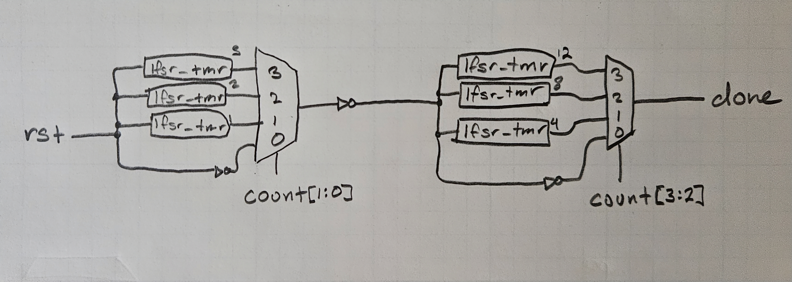

# LFSR Timer in SystemVerilog
This was part of a different project, but I figured I would end up using this pretty frequently, so I made it its own repository.

There are two parts to this:
## `lfsr_timer.sv`
This is a module that allows you to define a timer that waits for a specific, compile-time defined, amount of clock cycles.  The timer starts when reset is 0.  For example, if your number of cycles to wait is 2 cycles, then it would look like this:
```
-- CYCLE 0 --
rst = 1
done = 0
-- CYCLE 1 -- (this is the first wait cycle)
rst = 0
done = 0
-- CYCLE 2 -- (this is the second wait cycle):
rst = 0
done = 0
-- CYCLE 3 --
rst = 0
done = 1
```

By using an LFSR, you will only need a single 4-input XOR gate, `ceil(log_2(N+1))` flip flops arranged in a shifter, and an `ceil(log_2(N+1))`-input AND gate.  This avoids using an adder or an extremely long shifter with a traditional counter.  So our longest path is very short and the resource utilization is very low.

This was able to hit the max clock speed for a Xilinx Spartan 7 with -1 speed grade (464 MHz) on a timer of 1458 cycles.

## `timer.sv`
Building on the `lfsr_timer`, a series of muxes and timer modules can be used to build a custom timer with a runtime defined amount to count for.  They are generally wired as such:



It's similar to a barrel shifter.

The downside to this is that you have a very high resource utilization since for each layer you need `2**SELECT_WIDTH` lfsr_timers.

This design was able to hit max clock speed for a Xilinx Spartan 7 with a 3-bit counter width (464 MHz).
